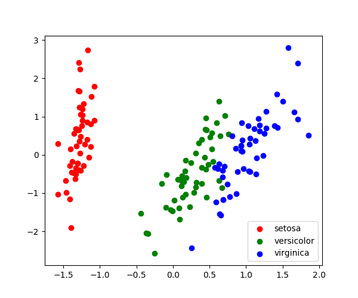

# Iris-Classification
This project serves as an introduction to Machine Learning using a well-known `IRIS` dataset. 

## PCA Approach
`PCA` (Principal Component Analysis) allows to visualize the dataset in 2-D. Since the Iris dataset is 4 dimensional, 
PCA reduces it into 2 dimensions. Another benefit that PCA brings to Machine Learning is that it optimizes the training time. 
```
pca = PCA(n_components = 2, whiten = True)
```

## Result
Upon training on the data, the script generates a 2-D plot showing iris classification. 



